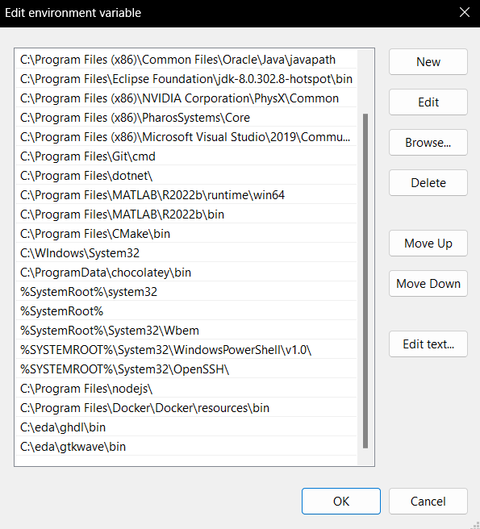
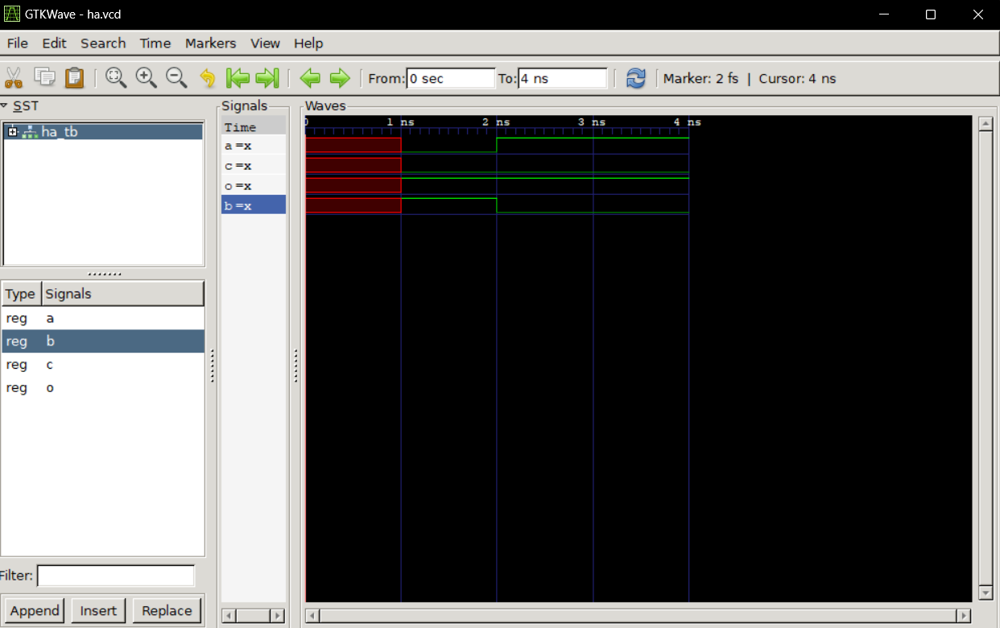
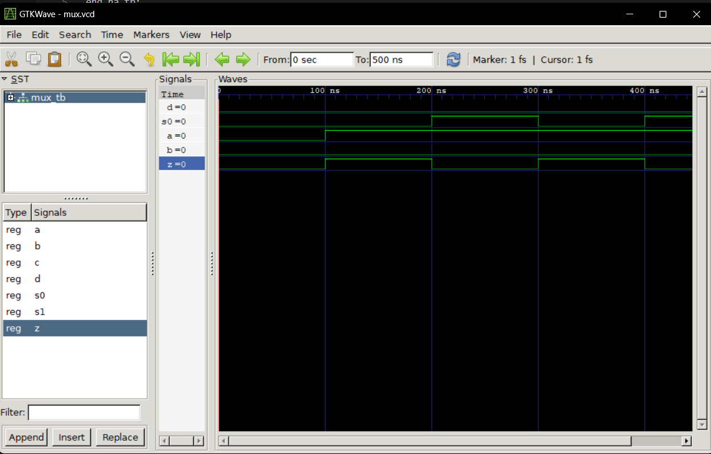

# LAB 1 
-------------------------------------------
## Installing GHDL and GTKWave

>After following the recommended video, I installed GHDL and GTKWave. GHDL is a hardware design language to analyze, process, and compile VHDL. GTKWave is a waveform viewer designed as a simulator to verify Verilog design.

## Half-Adder

I followed the video's example for the half-adder script. A half-adder takes two single-bit binary inputs to produce two outputs, a sum and carry (0 or 1). 

## Multiplexer

Next, I downloaded the 4:1 multiplexer files from the [DSD GitHub](https://github.com/kevinwlu/dsd/tree/master/ghdl) and imported them into GTKWave via similar commands from the attached video. 
