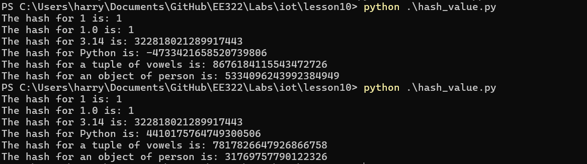
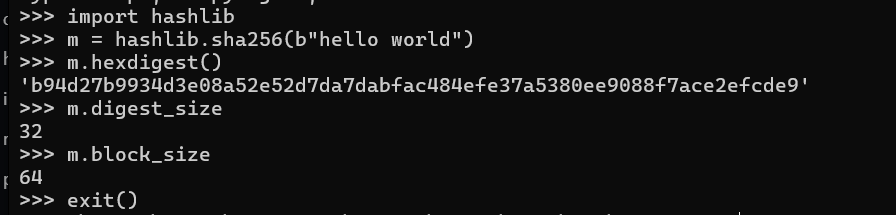
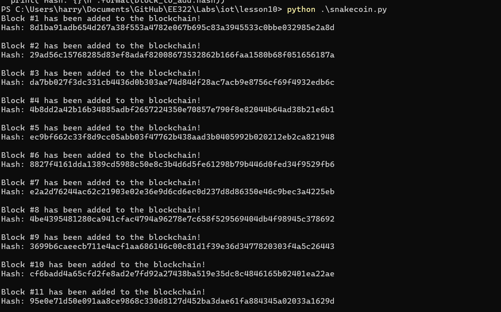
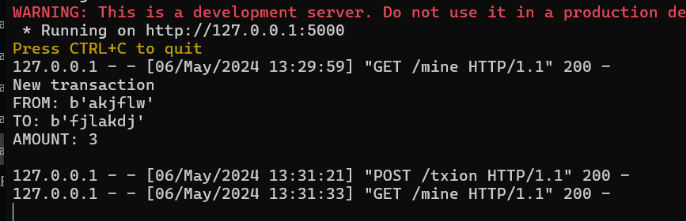
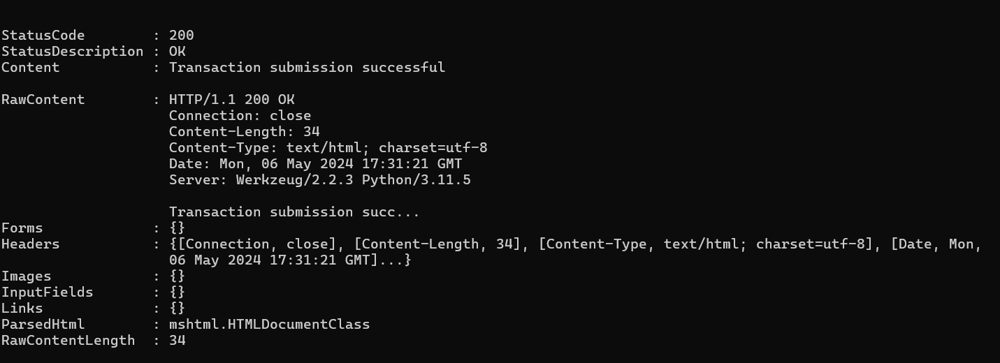
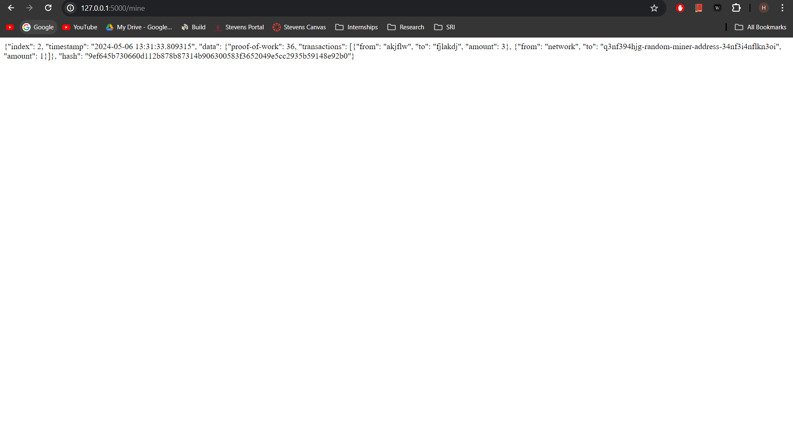
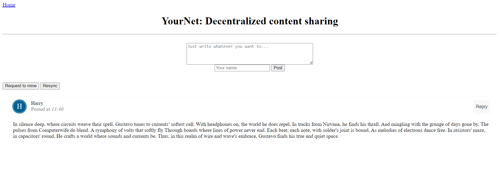

# LAB 10

## hash_py

To begin the lab, I ran ``hash_value.py`` twice to compare the results.

## SHA

Next, I imported hashlib and ran the SHA Hash algorithm.

## snakecoin

I ran ``snakecoin.py``, which adds blocks to the blockchain and outputs their hash.

## snakecoin server

After this, I ran snakecoin through one terminal, and generated a transaction through another.

## YourNet

I ran ``node_server.py`` and ``run_app.py`` in two different terminals and accessed the server through the localhoust route.

I chose a message, which was 14-line sonnet about my friend Gustavo.

