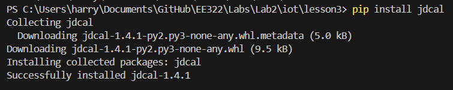
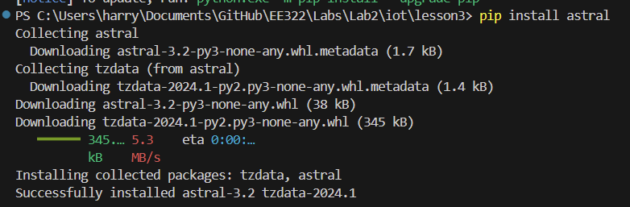
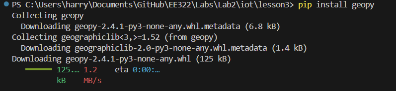
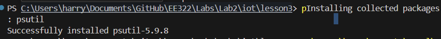

# LAB 3
-----------------------------------
## Installing Packages

Before I ran the necessary commands, I began by installing the required packages for this lab (jdcal, astral, geopy, and psutils)
### jdcall installation

### astral installation

### geopy installation

### psutils installation

While installing these I encountered an issue running any .py file. I figured out this was due to the multiple versions of Python installed on my laptop. To fix this, I simply pasted the path before executing the .py file as follows:

`C:\PATH TO\Python\Python311\python.exe julian.py`

## Executable Description