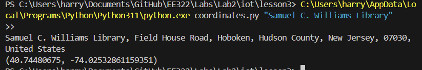
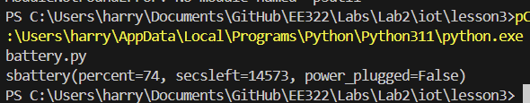

# LAB 3
## Installing Packages

Before I ran the necessary commands, I began by installing the required packages for this lab (jdcal, astral, geopy, and psutils)
### jdcall installation

### astral installation

### geopy installation

### psutils installation

While installing these I encountered an issue running any .py file. I figured out this was due to the multiple versions of Python installed on my laptop. To fix this, I simply pasted the path before executing the .py file as follows:

`C:\PATH TO\Python\Python311\python.exe julian.py`

## Executable Description

### julian.py

julian.py displays the current date as seen in the standard Gregorian calendar, and then the date in the Julian calendar format (time since the beginning of the Julian Period)

### date_example.py

date_example.py displays the date in two formats, and the individual day, month, and year. Then it displays the number of days since the first day of classes and until the last day of classes.

### datetime_example.py

datetime_example.py displays the time in various formats. It displays it in two current formats, UTC format, floating point, string format, and two various timestamps.

### time_example.py

time_example.py displayed the current time as a string, updating every ten seconds in the form of WEEKDAY MONTH DAY HR:MIN:SEC YEAR

### sun.py

sun.py prints the different Sun statuses (dawn, sunrise, etc) as well as the specificed time zone and coordinates.

### moon.py

moon.py prints the phases of the Moon from 0-27 (to represent different phases) up to the next time the Moon reaches its current phase

### coordinates.py execution

Executing coordinates.py with specifying Samuel C. Williams library as a string prints out the address and coordinates of the specified string.

### address.py execution

address.py prints out a specific address when coordinates are specified

### cpu.py execution 

cpu.py prints out the number of physical and logical cores. It also prints a list of floating points representing the utilizations/second for each CPU

### battery.py execution

battery.py prints out useful information regarding my system's battery such as current percent, seconds left, and a boolean displaying if my laptop is plugged in or not.

### documentstats.py execution

documentstats.py reads and opens a .txt file (document.txt, the Declaration of Independence) and prints the word count and the ten most frequently used words in the file.
