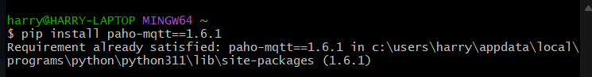
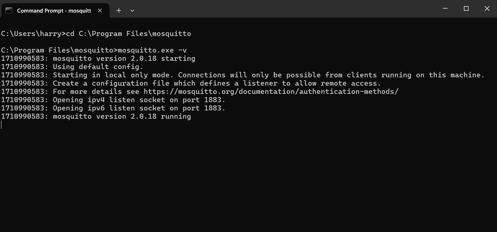
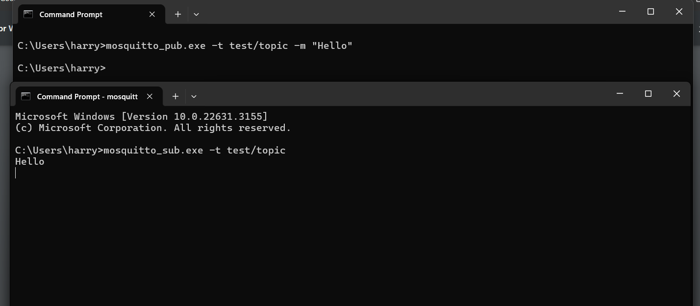
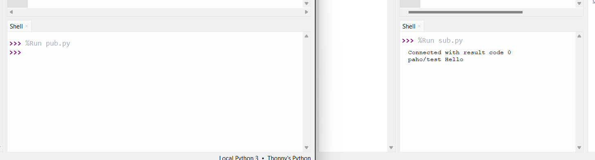
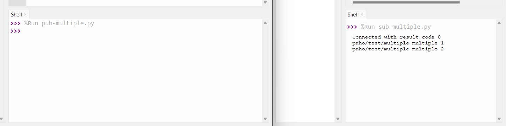
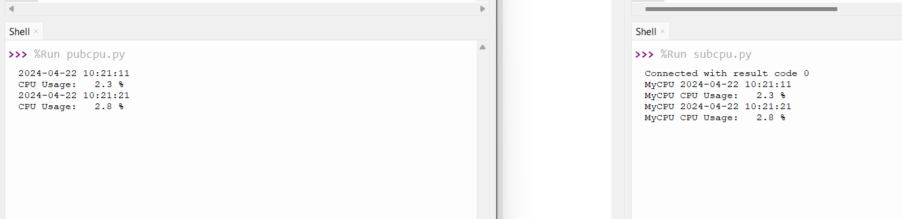

# LAB 5

## Installing & Starting Packages

To begin the lab, I went to install Mosquitto and paho-mqtt on my system. Due to prior research with Systems Eng. Professor Grogan, I had both libraries installed on my laptop.

I think went on to start up a Mosquitto terminal by using the -v command. Here it showed the open ports (default 1883) and the version that is installed.

## pub.py & sub.py

Next, I ran the pub and sub .py files through my terminal.

After a successful message reception, I decided to switch to the Thonny environment for ease of use, terminal view, and code editing.

## multiple pubsub

I then ran pub-multiple.py and sub-multiple.py from the Thonny environment.

## cpu usage 

Lastly, I ran the CPU usage files. This required installing psutils through the Thonny terminal.

