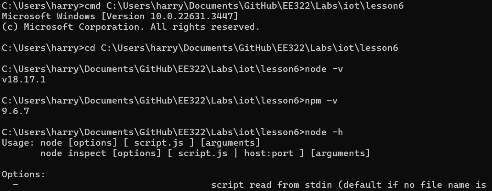
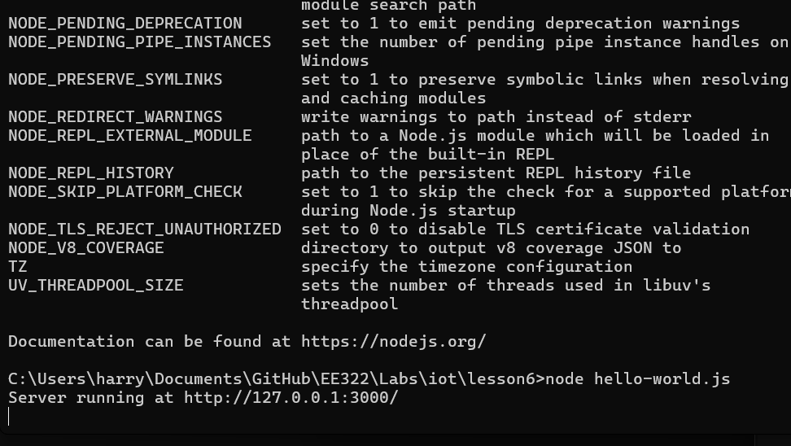
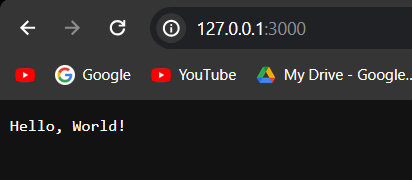
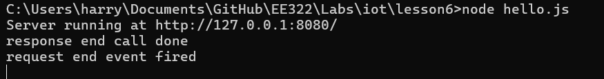
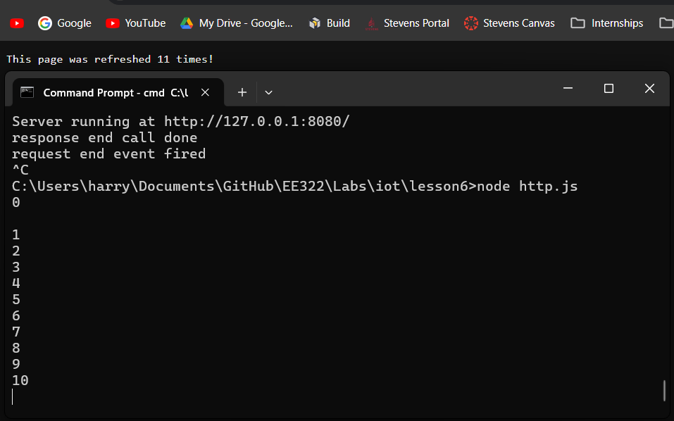
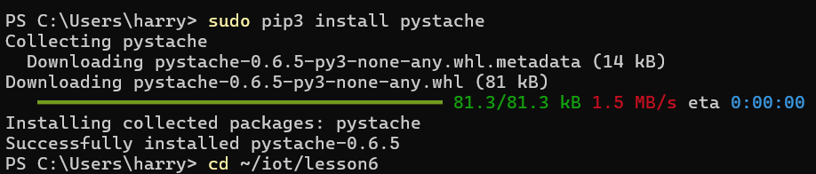
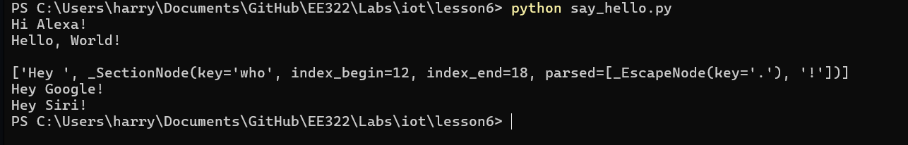

# LAB 6

## Installing Node.js

To start, we were instructed to install Node.js. I had Node.js installed previously, so all I had to do was double check my version.

## hello-world.js

I ran ``hello-world.js`` through the terminal and connected to ``http://127.0.0.1:3000/``

## hello.js

Running ``hello.js`` resulted in the following...

## http.js

And running ``http.js`` results in the following. The terminal integer increases with every page refresh

## Installing pystache

After Node.js, I installed pystache through the terminal.

## say_hello.py

To run ``say_hello.py`` I used the command ``python say_hello.py``, resulting in
