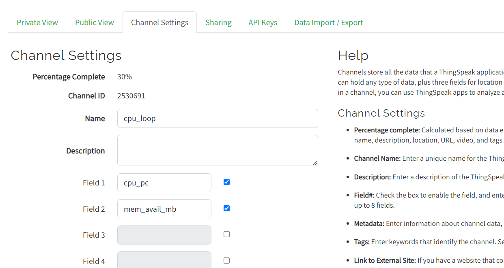
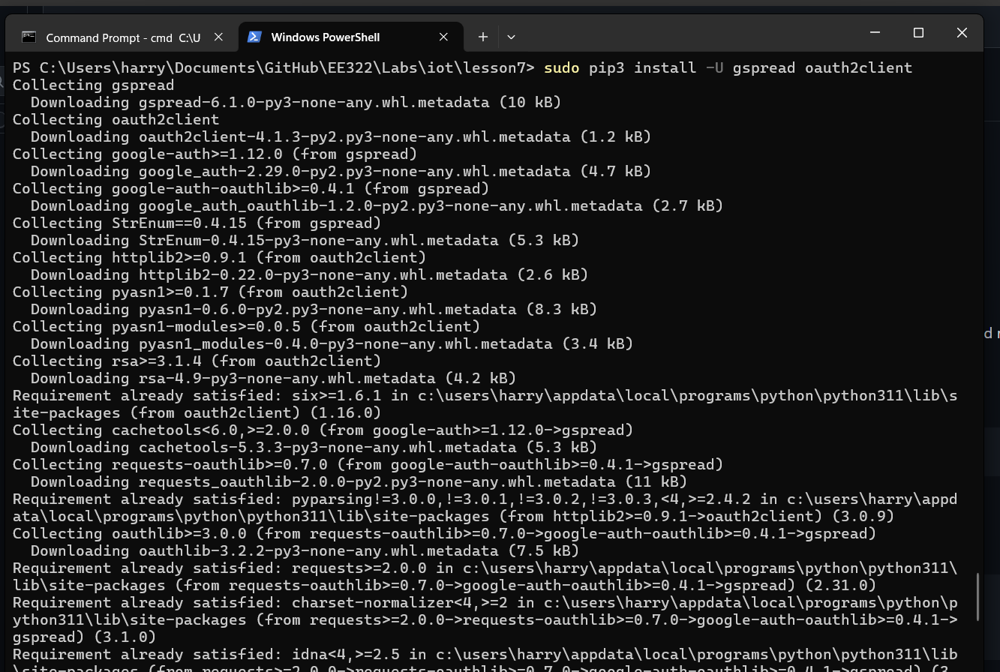
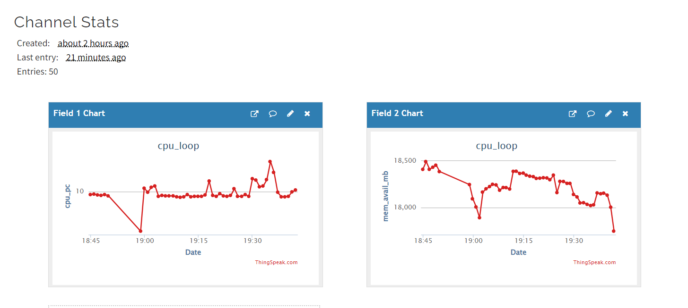
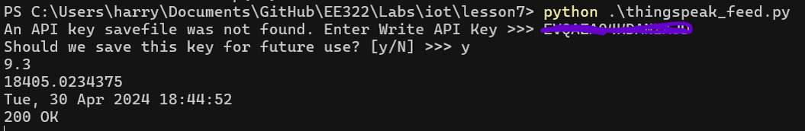
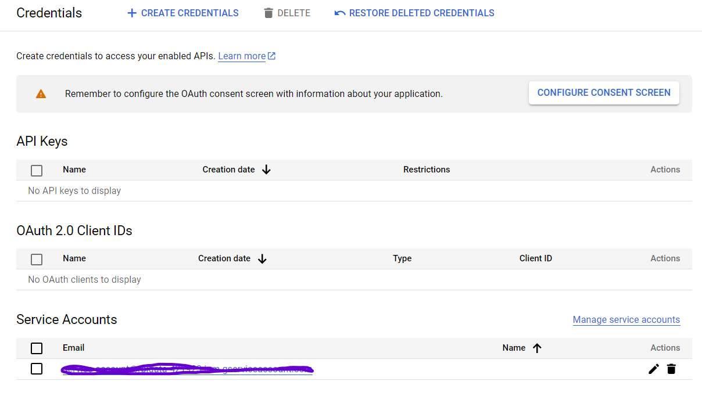
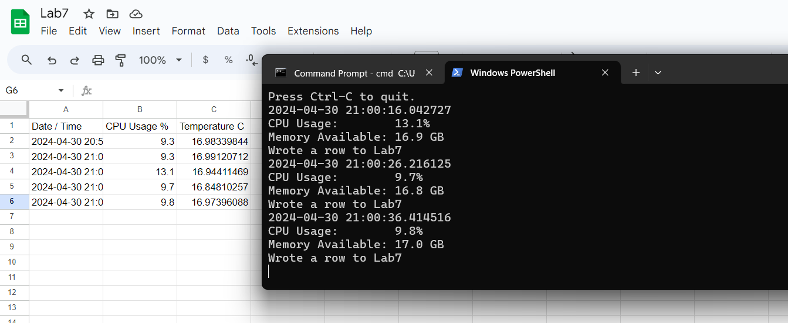

# LAB 7

## Thingspeak 

I began Lab 7 by signign up for Thingspeak through my ``@stevens.edu`` email and installing ``gspread``.

Next I created a channel for cpu_loop with two fields, cpu_pc and mem_avail_mb. I let it run for a little while and it generated these nice plots.

## API Key

Next I imported my generated API key to the ``thingspeak_feed.py`` file, where it was successfully imported and tested.

## Google API

After this, I created a Google Cloud IAM project and generated a key to use for Google sheets. I gave the project sheets access, and shared the generated email with a sheets file I made in my Google Drive.

