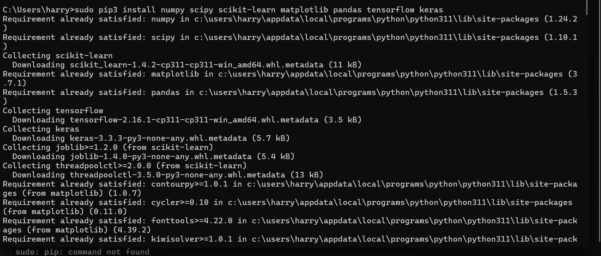
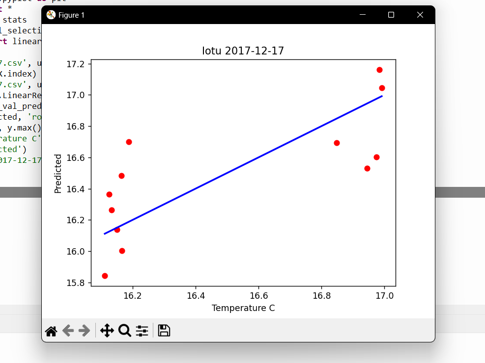
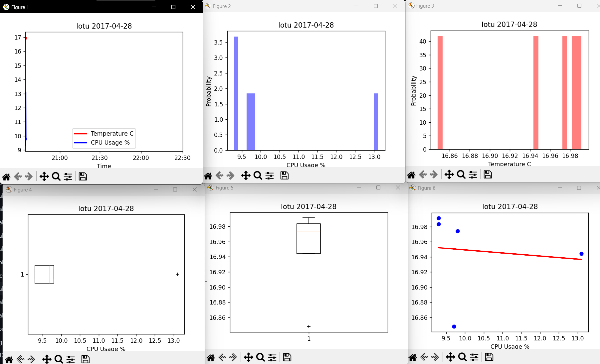

# LAB 8

## Installing Libraries

First, I started off this lesson by installing the necessary libraries for plotting, arithmetic, and data manipulation.

I already had many of these libraries from past projects and lessons.

## plt_cv2.py

Next I ran ``plt_cv2.py``. I ran this through the Thonny IDE. I had to edit to code to read my ``Lab7.csv`` file and then it ran perfectly.

## plt_final.py

Finally, I ran ``plt_final.py`` through Thonny and likewise edited the code to read lab 7's .csv file.

