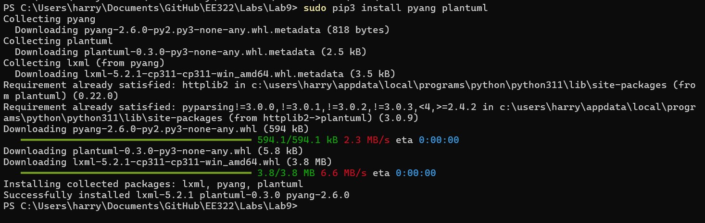
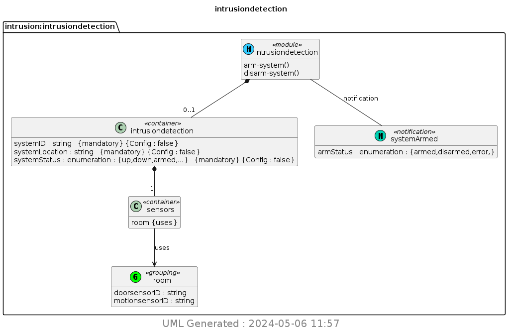

# LAB 9

## Installing packages

I began this lab by installing pyang and plantuml through the terminal.

## UML Conversion

Next, I ran the various commands to display the contents of the .yang file, convert to a .yin, and then generate a UML diagram.

